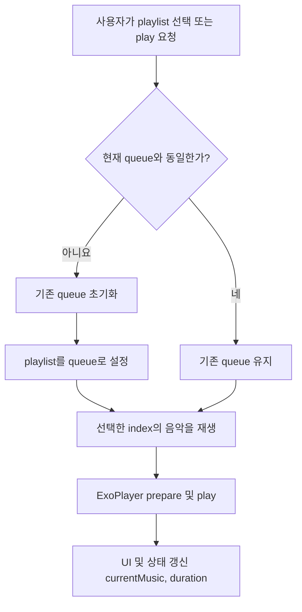

# 🎵 Music Player Flow Guide

이 문서는 `PlayerEnvironment`를 기준으로 음악이 어떻게 재생되는지를 설명합니다. 재생 흐름 중심으로 `playlist`, `play`, `queue` 간의 관계를 이해할 수 있도록 구성했습니다.

---

## 📌 핵심 구성요소

| 구성 요소        | 설명                                       |
| ---------------- | ------------------------------------------ |
| **playlist**     | 사용자가 선택한 음악 리스트                |
| **queue**        | 내부에서 관리되는 재생 목록 (`MusicQueue`) |
| **play**         | 현재 선택한 음악을 재생하는 트리거         |
| **ExoPlayer**    | 실제 음악을 재생하는 미디어 플레이어       |
| **currentMusic** | 현재 재생 중인 곡                          |

---

## 🔁 전체 재생 흐름

### 📋 순서도

